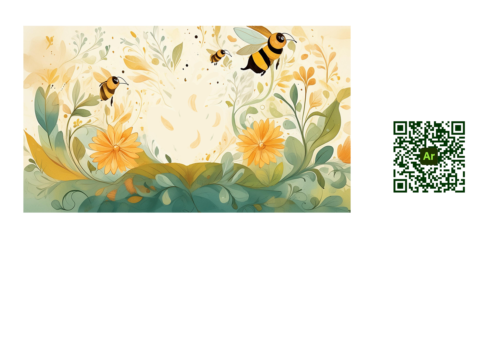

<h1>Ar Pop Up Book For Kids</h1>

<h2>About the Book</h2>

The book tells a story about a bee, named Sheila. Sheila travels across fields and forests to see hot air balloons in Bristol.

<h2>Book Contents</h2>

The AR book contains four pages. Each page is narrated. The majority of assets were created by me, Sarunas.

<h2>User Testing</h2>

Book was tested by two 29-month-old toddlers. Toddlers were engaged at the time. Four paper pages were printed, which led toddlers' imaginations to roam. 

<h2>Background Pages</h2>

There is an example of a page. The QR code on the right-hand side must be scanned to open the AR; then, a scene must be aligned within a scene picture on the device screen. Once everything is aligned, the science comes alive, and the Tap button shows up. This is where the story begins. 

Other pages can be found:

https://github.com/SarunasPersonal/AR_Pop_Up_Book/tree/main/Assets/Images/QRPages

<h2>The software used for the project</h2>
  <ul>Procreate</ul>
  <ul>Adobe Aero</ul>
  <ul>Adobe Firefly</ul>
  <ul>Adobe Photoshop</ul>
  <ul>Adobe Illustratore</ul>

